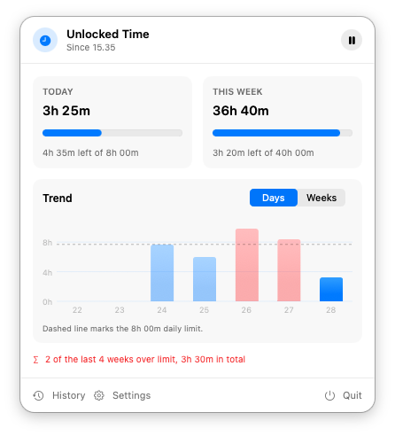
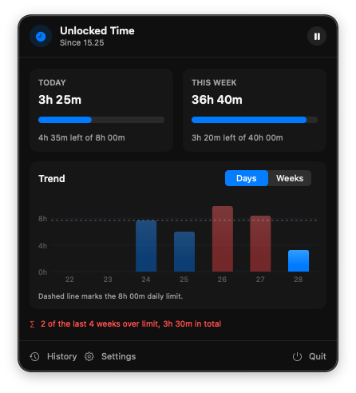
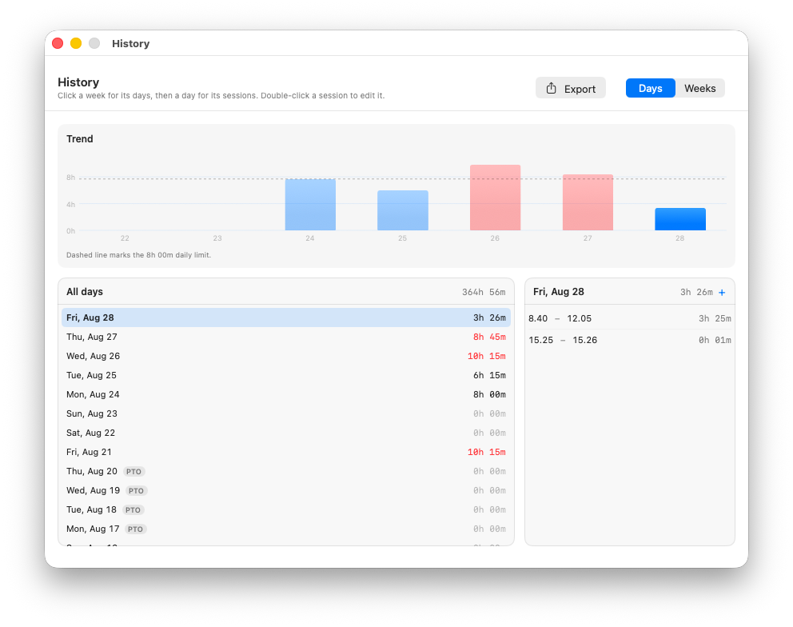
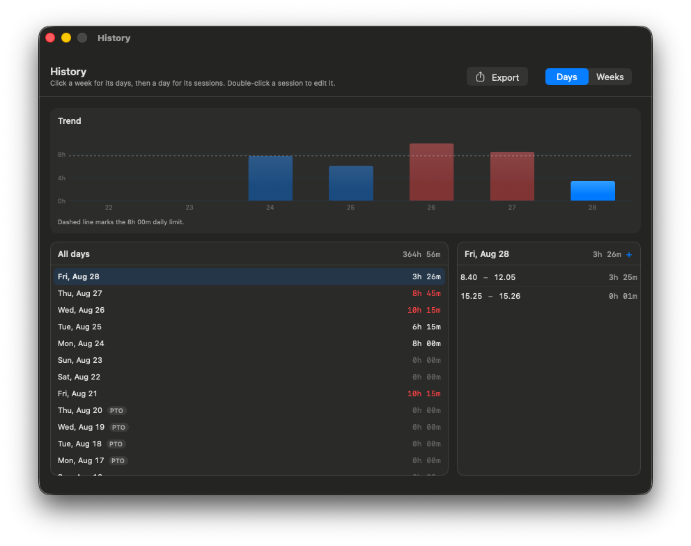
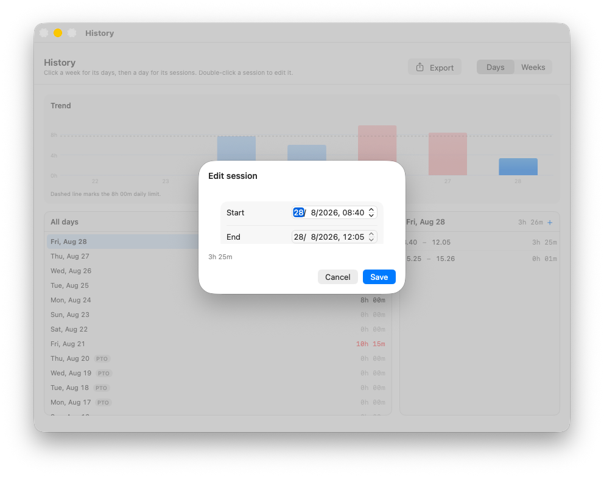
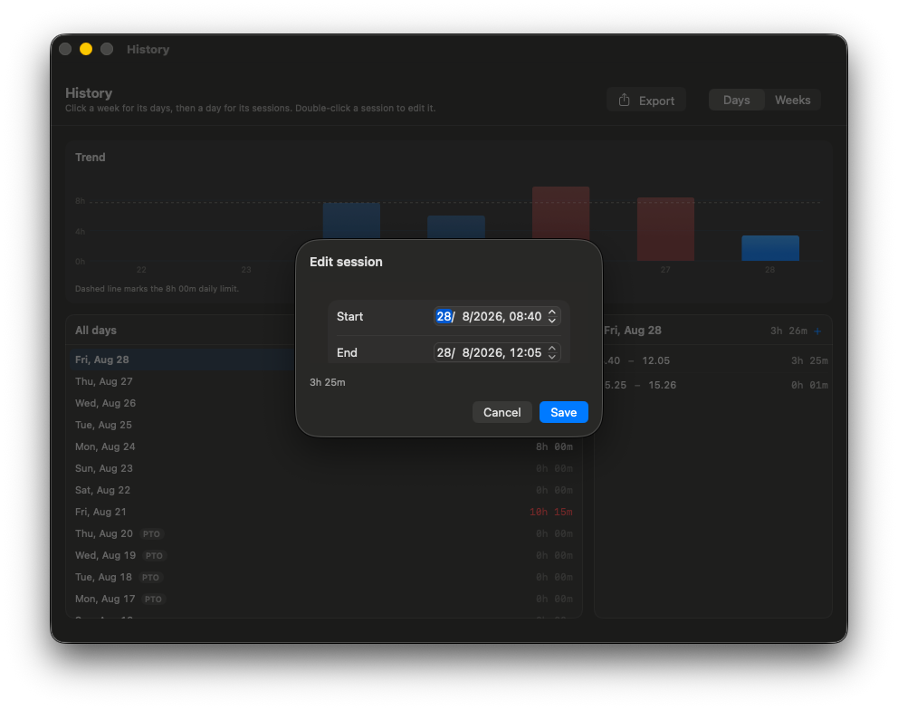

# Unlocked Time

A native macOS menu bar app that tracks how long your Mac is unlocked and reports daily and
weekly totals against limits you set.

## Screenshots

| Light | Dark |
| --- | --- |
|  |  |
|  |  |
|  |  |

These use generated sample data rather than real hours. Run the app with `--demo` to reproduce
them.

## What it shows

- Today's total against the daily maximum.
- This week's total against the weekly maximum.
- Remaining time, or a red over-limit amount.
- The moment the weekly limit was reached, once it is passed.
- A trend chart of the last 7 days or 8 weeks, with the limit marked.
- In the History window, a trend chart that scrolls back through all history and zooms out to a
  year of days or ten years of weeks, or a calendar of a year of days.
- A matching list of those days or weeks.
- Which days or weeks are marked as PTO.
- Manual pause and resume.

## History

The list covers everything recorded, newest first. Clicking a week opens that week's days,
and clicking a day opens the individual sessions worked that day, with start and end times.

The trend chart starts on the last 7 days or 8 weeks. Scroll it sideways to go back in time, and
pinch, use the magnifier buttons, or press ⌘+ and ⌘− to zoom between fixed spans: from a week to
a year of days, or from 8 weeks to ten years of weeks. Zooming keeps the selected day or week in
place, and selecting one in the list scrolls the chart to it. Once zoomed out past a few weeks, a
line shows the trailing 7-day or 4-week average.

The **Chart / Calendar** switch in the trend card's header swaps the chart for a calendar: a
year of days as a grid of squares, one column per week, like a GitHub contributions graph. Shading
deepens with the hours tracked, in quarters of the daily limit. Days over the daily limit are red,
in four shades that deepen with the overtime: up to 30 minutes, up to an hour, up to two hours,
and more than two hours over. PTO days are grey. It opens on the 12 months ending today; the arrows step back and forward a
year at a time, through all recorded history. Hover over a square for its date and hours, and
click it to select that day, or in Weeks mode the week containing it. The calendar always shows
days, so in Weeks mode too its summary is of days.

Under the chart, a summary covers whatever is in view: the total, the average day or week, how
many were over the limit and by how much in total, and the number of PTO days. Averages leave out
days or weeks without tracked time, and the one still in progress. The over-limit count uses the
same completed periods. Day averages and counts also leave out weekends and PTO days, so they
compare with the daily limit. Time tracked on those days still counts towards the total and the
overage.

Sessions can be corrected: right-click one to edit or delete it, or use the plus button in the
sessions column to add a session to the selected day. The session running now cannot be edited,
since it has no end yet.

## PTO

Right-click a day or week in the history list to mark it as PTO, or to clear the mark. Marking a
week marks all seven of its days, and a week shows as PTO only when every day is marked.

PTO is a label by default. It does not change any total, and time tracked on a PTO day is still
counted.

With **PTO reduces weekly maximum** on, each PTO weekday lowers that week's maximum by the
configured **PTO day value**, so a week with a day off is judged against a smaller ceiling
instead of looking artificially under. Weekend days never reduce it, and the result never drops
below zero.

## Tracking

A session runs while the app is open and the screen is unlocked. It stops when the screen locks,
the display sleeps, or the user session becomes inactive, and resumes on unlock or wake.

With **Pause when idle** on, a session also stops after the configured number of minutes without
keyboard or mouse input. The stop is backdated to the last input, so the idle stretch is never
counted, and tracking resumes as soon as you use the Mac again. Idle is measured from input
alone, so watching a video counts as idle.

The app only observes these events while it is running. It cannot reconstruct activity from
periods when it was closed. After an unexpected exit, an open session is closed at its last
one-minute heartbeat.

## Settings

Set the daily and weekly maximum with separate hour and minute adjusters, in 5-minute steps.

**PTO reduces weekly maximum** lowers a week's ceiling for each PTO weekday, by the **PTO day
value**. Off by default.

**Pause when idle** turns idle detection on or off, and **Idle after** sets the threshold in
minutes. Idle pausing defaults to on with a 10-minute threshold.

**Start at login** registers the app as a login item, so tracking resumes after a restart
without opening it manually.

**Import work log** reads a plain text file in the [work log format](#work-log-format). Exact
duplicates are skipped, so importing the same file twice is safe.

History and settings are stored locally:

```text
~/Library/Application Support/UnlockedTime/history.json
```

## Work log format

Import and export share one plain text format:

```text
# a hash starts a comment
2026-08-17 08:20-14:30+16:00-23:30
2026-08-19 PTO
2026-08-20 PTO 09:00-11:00
```

Each line is a date followed by a `PTO` marker, one or more intervals, or both. Intervals are
joined with `+`. Blank lines and comments are ignored, open intervals are rejected, and a
session running to midnight ends at `24:00`.

**Export** in the History window writes this format, so anything exported can be imported again.
Times are written to the minute, and a session in progress is written up to the current time.

## Build

Requires macOS 14 or newer and Xcode Command Line Tools.

```sh
./build-app.sh
open "dist/Unlocked Time.app"
```

Import a work log at launch:

```sh
open -n "dist/Unlocked Time.app" --args --import ~/time_worked.txt
```

Run against generated sample data instead of your own history, as used for the screenshots:

```sh
open -n "dist/Unlocked Time.app" --args --demo
```

The app has no Dock icon. Keep it running for tracking to continue.

The app icon is generated rather than stored as an opaque asset. To change it, edit
`Tools/make-icon.swift`, then:

```sh
swift Tools/make-icon.swift
iconutil -c icns App/AppIcon.iconset -o App/AppIcon.icns
```

## Tests

```sh
swift test
```

## Licence

MIT. See [LICENSE](LICENSE).

---

Built with GitHub Copilot, from the first prototype through to the current app.
